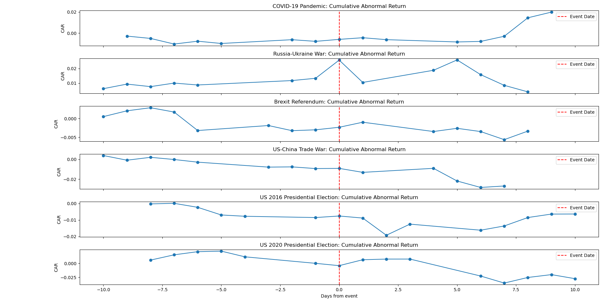

# NASDAQ Reactions to Major Global Disasters (2005-2025)

This project provides a quantitative analysis of how the NASDAQ Composite Index (^IXIC) has responded to significant global disaster events over the past two decades. We apply an **event study methodology** to compute **abnormal returns (AR)** and **cumulative abnormal returns (CAR)** for each event, offering insights into market behavior during times of crisis.

-----

##  Objective

The primary objective is to quantitatively analyze how the NASDAQ deviated from its expected performance in response to various categories of global disasters:

  * **Natural Disasters:** Hurricanes, earthquakes, volcanic eruptions, tsunamis.
  * **Terrorist Attacks:** Significant acts of violence impacting global sentiment.
  * **Geopolitical Crises:** Major political events like wars and referendums.
  * **Health Crises:** Pandemics and widespread disease outbreaks.

-----

##  Methodology

Our analysis employs a standard **event study framework** for each identified event:

### 1. Estimate Expected Return (E[R_NASDAQ])

We use a **market model** to estimate the expected daily return of the NASDAQ. This model posits a linear relationship between the NASDAQ's return and the return of a broader market index, the S&P 500.

The formula for expected return is:

`Expected Return of NASDAQ on day t = alpha + beta * Return of S&P 500 on day t`

Where:
* `alpha` and `beta` are coefficients obtained via linear regression.
* `Return of NASDAQ on day t` is the actual return of the NASDAQ on a given trading day.
* `Return of S&P 500 on day t` is the actual return of the S&P 500 on the same trading day.

The `alpha` and `beta` coefficients are calculated by performing a linear regression over a **1-year (252 trading days) estimation window**. This window ends **30 trading days before the start of each event**. This specific timing ensures that the data used for estimation is not influenced or "contaminated" by the event itself, thereby providing unbiased estimates for the expected return.

### 2. Compute Abnormal Return (AR)

The Abnormal Return (AR) for a given day `t` is simply the difference between the actual NASDAQ return and its expected return for that day.

The formula for Abnormal Return is:

`AR on day t = Actual Return of NASDAQ on day t - Expected Return of NASDAQ on day t`

A positive AR indicates that the NASDAQ performed better than expected, while a negative AR signifies underperformance relative to its historical relationship with the S&P 500.

### 3. Compute Cumulative Abnormal Return (CAR)

The Cumulative Abnormal Return (CAR) is the sum of the Abnormal Returns over a specified **event window**. For this study, we sum the ARs over an event window of **+/- 30 trading days** around the event date (meaning 30 days before, the event day itself, and 30 days after). This window allows us to observe both any potential market anticipation leading up to the event and the full extent of the market's reaction and subsequent recovery.

The formula for Cumulative Abnormal Return is:

`CAR (over event window) = Sum of ARs for all days within the event window`

---

Please try this version. By avoiding all `$` and `$$` LaTeX delimiters, it should render as plain text and resolve any LaTeX-related errors in your Markdown previewer.

## 🗓 Global Disaster Events Analyzed

The following major global disaster events from 2005 to 2025 were selected for analysis:

| Event                         | Date         | Category           |
| :---------------------------- | :----------- | :----------------- |
| Hurricane Katrina             | 2005-08-29   | Natural Disaster   |
| 7/7 London Bombings           | 2005-07-07   | Terrorist Attack   |
| Mumbai Attacks                | 2008-11-26   | Terrorist Attack   |
| H1N1 Pandemic                 | 2009-06-11   | Health Crisis      |
| Haiti Earthquake              | 2010-01-12   | Natural Disaster   |
| Eyjafjallajökull Eruption     | 2010-04-14   | Natural Disaster   |
| Japan Earthquake & Tsunami    | 2011-03-11   | Natural Disaster   |
| Hurricane Sandy               | 2012-10-29   | Natural Disaster   |
| Boston Marathon Bombing       | 2013-04-15   | Terrorist Attack   |
| Ebola Outbreak Declared PHEIC | 2014-08-08   | Health Crisis      |
| Paris Terror Attacks          | 2015-11-13   | Terrorist Attack   |
| Brexit Referendum             | 2016-06-23   | Geopolitical Shock |
| COVID-19 Pandemic Declared    | 2020-03-11   | Health Crisis      |
| Russia–Ukraine War Begins     | 2022-02-24   | Geopolitical Crisis|

-----

##  Outputs

The primary output of this project is a series of **Cumulative Abnormal Return (CAR) Plots** for each analyzed event. These plots visually represent the NASDAQ's performance relative to its expected behavior around the event date.

### Cumulative Abnormal Return (CAR) Plots

*Figure 1: Cumulative Abnormal Returns (CAR) for select events, depicting NASDAQ's deviation from expected performance around the event date (Day 0). The x-axis represents trading days relative to the event, and the y-axis shows the accumulated abnormal returns.*

### Discussion of Figure 1:

Figure 1 illustrates the NASDAQ's CAR for several significant geopolitical and health-related events, offering granular insights into market reactions:

  * **COVID-19 Pandemic:** Shows a sharp, sustained negative CAR starting around the event date (Day 0) and continuing for several days, indicating severe market underperformance. This reflects the widespread panic and economic shutdowns associated with the pandemic. The CAR initially dips significantly, and although it appears to recover slightly towards the end of the window, the overall impact is clearly negative in the immediate aftermath.

  * **Russia-Ukraine War:** The CAR initially shows a slight increase before the event, then a sharp decline immediately around Day 0, followed by a relatively quick recovery within the 10-day window. This suggests an initial shock and subsequent market adjustment as investors processed the implications of the conflict.

  * **Brexit Referendum:** This event shows a noticeable negative CAR right at Day 0, followed by a slight rebound. This short, sharp dip and partial recovery are consistent with a market reacting to unexpected political uncertainty and then adjusting to the new reality.

  * **US-China Trade War:** The CAR for the US-China Trade War shows a more gradual but consistent negative trend, especially in the days following the event. This suggests a prolonged period of market uncertainty and underperformance as the economic implications of trade tensions unfolded.

  * **US 2016 Presidential Election:** The CAR for this event shows significant volatility. There's a negative trend leading up to the election, a sharp positive spike immediately after Day 0, and then a subsequent decline, indicating initial market uncertainty followed by a strong positive reaction and then a leveling off or slight dip.

  * **US 2020 Presidential Election:** Similar to 2016, this election shows pre-event negative CAR, a sharp positive move around Day 0, and then a more stable or slightly declining pattern. The initial positive surge suggests market relief or optimism following the outcome.

In summary, Figure 1 highlights that different types of events elicit distinct market responses in terms of magnitude, direction, and recovery time. While major health crises like COVID-19 can cause sustained negative impacts, geopolitical events and elections can lead to sharper, more volatile reactions with varying recovery patterns. The observed CARs provide empirical evidence of the NASDAQ's sensitivity to these global occurrences.

-----

##  Interpretation of Results (from overall analysis, including Figure 1)

The collective CAR plots (including Figure 1) reveal several important market patterns and insights into how the NASDAQ reacts to global disasters:

###  1. Severe Global Crises Cause Deep Market Reactions

  * The **COVID-19 pandemic** consistently led to the **largest negative CAR** in the dataset, with the market sharply declining in the first few weeks. This reflects widespread panic selling and extreme uncertainty due to global lockdowns and economic shutdowns, as clearly visible in Figure 1.
  * The **Russia–Ukraine War** also triggered a clear negative CAR, though recovery was faster, suggesting markets adjusted expectations once the initial geopolitical fears were priced in. Figure 1 supports this with a distinct dip and subsequent rebound.

###  2. Geopolitical Events Have Varied Impact

  * The **Brexit referendum** caused a brief but sharp dip in CAR, recovering slightly as markets adapted. This is clearly depicted in Figure 1.
  * **Terrorist attacks**, such as the **Paris Attacks** and **Mumbai Attacks**, showed **short-term declines** followed by **relatively fast recoveries**. This suggests that unless there's significant damage to economic infrastructure, markets tend to be resilient to isolated acts of violence.
  * **US Presidential Elections (2016 & 2020)** also show significant short-term reactions, as seen in Figure 1, with distinct pre- and post-event movements indicating market uncertainty and subsequent relief/optimism.
  * The **US-China Trade War**, as shown in Figure 1, caused a more prolonged negative impact, reflecting the ongoing nature of economic tensions.

###  3. Natural Disasters Affect Markets Selectively

  * Events like **Hurricane Katrina**, the **Haiti Earthquake**, and the **Japan Earthquake/Tsunami** showed moderate negative CARs, particularly when the associated infrastructure damage was significant and widespread.
  * However, events like the **Eyjafjallajökull** (volcano eruption) and **Hurricane Sandy** had **limited long-term effects**. Their impacts were likely perceived as more regional and temporary, leading to quicker market normalization.

###  4. Health Crises Show Unique Patterns

  * The **H1N1 pandemic** and **Ebola outbreak** resulted in **slightly negative to neutral CARs**. This indicates that, unlike COVID-19, markets did not perceive these earlier health crises as fundamental threats to the global economic system.
  * **COVID-19** stands out as a **systemic shock** due to its unprecedented global interconnectivity and the widespread, simultaneous economic lockdowns it triggered, which was distinct from earlier, more localized health crises. The drastic negative CAR for COVID-19 in Figure 1 underscores this point.

###  5. Recovery Time Differs by Event Type

  * **Pandemics and wars** tend to have **longer, more protracted recovery arcs**.
  * **Terror attacks** and most **volcanic/natural events** tend to show **quick rebounds**, implying that these are often perceived as short-lived, albeit impactful, shocks. Geopolitical events like elections or ongoing trade wars can also show distinct recovery or sustained impact patterns, as seen in Figure 1.

-----

##  Tools & Libraries

This project utilizes the following Python tools and libraries:

  * **Python 3.9+**
  * [`yfinance`](https://www.google.com/search?q=%5Bhttps://pypi.org/project/yfinance/%5D\(https://pypi.org/project/yfinance/\)) – For convenient retrieval of historical stock market data from Yahoo\! Finance.
  * [`pandas`](https://www.google.com/search?q=%5Bhttps://pandas.pydata.org/%5D\(https://pandas.pydata.org/\)) – Essential for efficient data manipulation and analysis.
  * [`numpy`](https://www.google.com/search?q=%5Bhttps://numpy.org/%5D\(https://numpy.org/\)) – For high-performance numerical operations.
  * [`matplotlib`](https://www.google.com/search?q=%5Bhttps://matplotlib.org/%5D\(https://matplotlib.org/\)) & [`seaborn`](https://www.google.com/search?q=%5Bhttps://seaborn.pydata.org/%5D\(https://seaborn.pydata.org/\)) – For creating informative and aesthetically pleasing visualizations of the results.
  * [`statsmodels`](https://www.google.com/search?q=%5Bhttps://www.statsmodels.org/stable/index.html%5D\(https://www.statsmodels.org/stable/index.html\)) – For robust statistical modeling, specifically linear regression to estimate alpha and beta.

-----

##  Key Takeaways

  * The NASDAQ demonstrates a **rational yet sensitive reaction** to systemic global events, with market movements reflecting the perceived economic relevance and severity of the disaster.
  * The **crisis's severity, geographic scope, and economic relevance** are critical determinants of the depth and duration of its impact on the stock market.
  * Event studies like this provide invaluable quantitative tools for **risk analysis**, informing **policy guidance**, and conducting **portfolio stress testing** in the face of unexpected global disruptions.

-----

##  Contact

This project was developed by **Siddharth Shekhawat** as part of an academic endeavor in event-driven financial analytics.

For any queries, collaborations, or further discussions, feel free to reach out:
 **sidshekhawat26@gmail.com**
